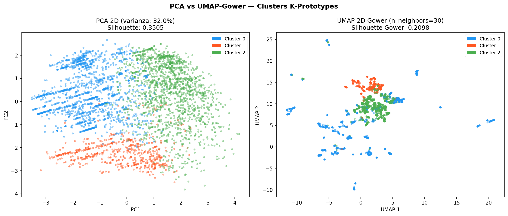
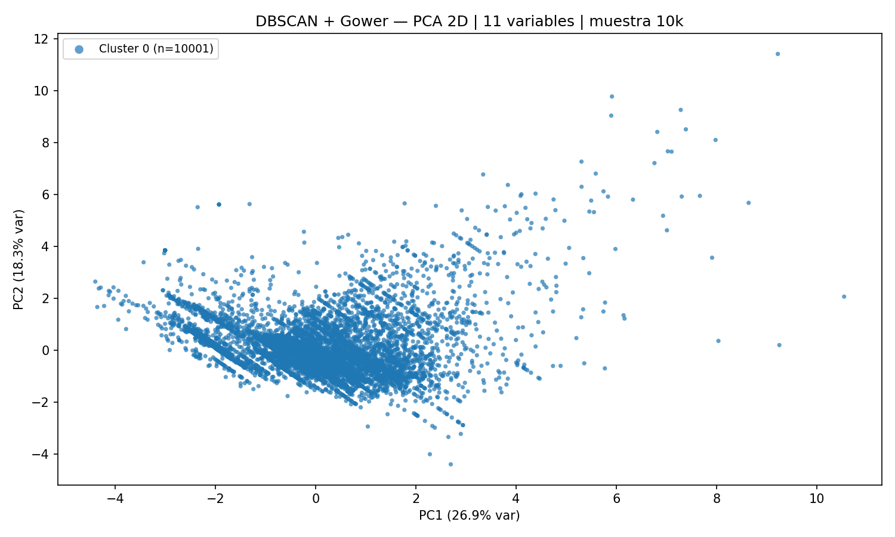
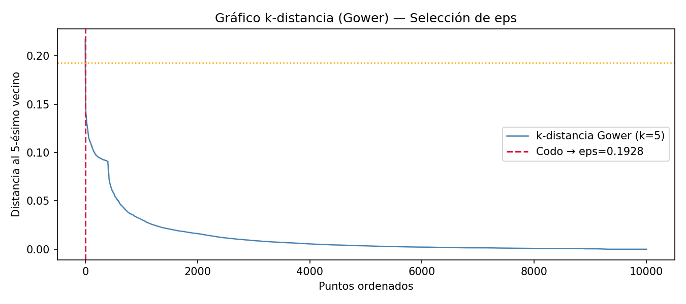
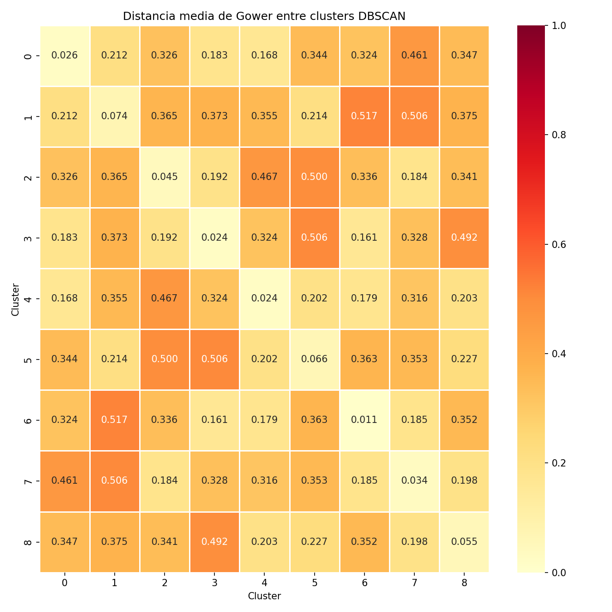

# Segmentacion de Clientes Corporativos — K-Prototypes + DBSCAN

[](https://python.org)
[](https://streamlit.io)
[](https://scikit-learn.org)
[](LICENSE)

Pipeline completo de segmentacion de clientes con **variables mixtas** (numericas + categoricas): desde EDA hasta dashboard interactivo con autenticacion.

---

## Resultados

| Metrica | Valor |
|---|---|
| Registros segmentados | 355,796 |
| Clusters encontrados | 3 |
| K optimo | 3 |
| Gamma optimo | 2.0 |
| Random Forest accuracy | **99.65%** |
| Regresion Logistica accuracy | **99.96%** |
| Variables seleccionadas | 16 (9 numericas + 7 categoricas) |

### Perfiles de Segmentos

| Cluster | Nombre | Registros | % Total | Perfil |
|---|---|---|---|---|
| 0 | **Titulares Maduros** | 201,643 | 56.7% | Edad media 48 anos, estrato 1, mayor antiguedad |
| 1 | **Familias Premium** | 75,304 | 21.2% | Valor total alto, multiples afiliados, con dependientes |
| 2 | **Jovenes en Crecimiento** | 78,849 | 22.2% | Menor edad, menor cuota, potencial de crecimiento |

---

## Visualizaciones del Modelo

<table>
<tr>
  <td></td>
  <td></td>
</tr>
<tr>
  <td align="center"><em>UMAP vs PCA — separacion de clusters</em></td>
  <td align="center"><em>DBSCAN + distancia Gower</em></td>
</tr>
<tr>
  <td></td>
  <td></td>
</tr>
<tr>
  <td align="center"><em>Curva K-distancia — seleccion de eps DBSCAN</em></td>
  <td align="center"><em>Distancias medias Gower entre clusters</em></td>
</tr>
</table>

---

## Arquitectura del Pipeline

```
Fuentes de datos (4 archivos)
        |
        v
01_Data_limpia_EDA_corporativo.ipynb
   Carga + Limpieza + Homologacion + Geografia + Features + EDA
        |
        v  data_limpia.csv
        |
02_Ingenieria_y_modelado.ipynb
   Seleccion de variables (3 capas)
        |--- K-Prototypes (Elbow + Silhouette + Gamma search)
        |--- Validacion (Random Forest + Regresion Logistica)
        |--- DBSCAN + Gower + propagacion KNN
        |
        v  resultado_etiquetado.csv / modelo_clusters_rf.pkl
        |
03_Analisis_del_segmento.ipynb
   Perfiles por cluster + analisis comercial
        |
        v
app.py (Dashboard Streamlit)
   5 paginas: KPIs / PCA interactivo / Explorar registros / Clasificar cliente / Estadisticas
```

---

## Seleccion de Variables — 3 Capas de Filtrado

| Capa | Tecnica | Criterio |
|---|---|---|
| Pre-filtro | Exclusion manual | IDs, varianza cero, >50% nulos |
| 1A | Coeficiente de variacion (CV) | Descarta CV < 0.10 |
| 1B | Entropia de Shannon | Descarta H_rel < 0.30 |
| 2A | V de Cramer | Elimina redundancia categ. (>0.70) |
| 2B | Spearman | Elimina redundancia numerica (>0.85) |
| 2C | Eta cuadrado | Detecta asociacion num vs categ |
| 3 | Silhouette Leave-One-Out con Gower | Valida cada variable individualmente |

---

## Variables del Modelo Final

**Numericas (9):** Total_afiliados, Repatriacion, Bicicleta, Salud, Cuotas, ValorTotal_scaled, Cantidad_mascotas, Estrato, Edad

**Categoricas (7):** Canal, REGION, TienePadres_V, Sexo, Producto, Estadocivil, tiene_nucleo_familiar

---

## Stack Tecnologico

- **Clustering:** `kmodes` (K-Prototypes), `scikit-learn` (DBSCAN, RF, LR), `gower`
- **Feature engineering:** `phik` (correlacion mixta), `scipy`, `sklearn` (PowerTransformer Yeo-Johnson)
- **Visualizacion:** `plotnine` (ggplot), `matplotlib`, `seaborn`, `umap-learn`
- **Dashboard:** `streamlit`, `plotly`, autenticacion con SHA-256 + sesiones persistidas en disco
- **Datos:** `pandas`, `numpy`, `openpyxl`

---

## Estructura del Repositorio

```
.
+-- app.py                           # Dashboard Streamlit (5 paginas)
+-- gestionar_usuarios.py            # CLI para administrar credenciales
+-- convertir_datos.py               # Convierte CSV/XLSX a Parquet (carga 10x mas rapida)
+-- requirements.txt                 # Dependencias Python
+-- iniciar_tablero.bat              # Script de arranque Windows
+-- modelo_metadata.json             # Parametros del modelo entrenado
+-- metricas_validacion.csv          # Metricas RF y LR
+-- perfiles_clusters.csv            # Perfiles descriptivos por cluster
+-- municipios_coordenadas.csv       # Tabla de referencia geografica
+-- .streamlit/config.toml           # Configuracion Streamlit
+-- imagenes/                        # Logos y recursos graficos
+-- 01_Data_limpia_EDA_corporativo.ipynb
+-- 02_Ingenieria_y_modelado_de_caracteristicas.ipynb
+-- 03_Analisis_del_segmento_de_clientes.ipynb
+-- ESTADO_PROYECTO.md               # Documentacion tecnica del pipeline
+-- VALIDACION_KPROTOTYPES.md        # Guia de validacion tecnica
```

---

## Instalacion

```bash
pip install -r requirements.txt
```

### Configurar usuarios (primera vez)

```bash
python gestionar_usuarios.py
# Opcion 3 -> Agregar usuario
```

### Convertir datos a Parquet (opcional, acelera carga)

```bash
python convertir_datos.py
```

### Iniciar dashboard

```bash
python -m streamlit run app.py
```

---

## Notas tecnicas

- **Dataset:** ~355k registros tras limpieza y filtro de canales. No incluido en el repositorio (datos privados).
- **Modelos pkl:** No incluidos por tamano (~200 MB) y contienen datos de entrenamiento privados. Reentrenar con `02_Ingenieria...ipynb`.
- **Escala DBSCAN:** Matriz Gower sobre 300k filas requiere ~350 GB RAM. Se trabaja con muestra 10k + propagacion KNN.
- **Produccion:** `modelo_clusters_rf.pkl` permite asignar cluster a nuevos clientes sin reentrenar K-Prototypes.

---

*Proyecto de analitica avanzada — segmentacion de clientes con variables mixtas para gestion comercial y toma de decisiones.*